# Practica1_SXE
> Guia basada en "How to install WordPress on Ubuntu" de *Pankaj Kumar*
## Introducción

Esta guía se centrará en el proceso de instalación de wordpress por CLI, usaremos una distribución sin entorno gráfico, en mi caso, **Ubuntu Server**, en concreto la versión LTS **26.04.1**.

Debido al objetivo principal de esta práctica daré por hechos conocimientos básicos de virtualización como crear una máquina virtual con **Ubuntu Server** y demás.

## Entorno de la Guía:

Como aclaración, he realizado la guía desde un equipo con MacOS Tahoe y un procesador de Apple Silicon así que hay ciertos detalles a tener en cuenta.

Los procesadores de Apple Silicon y otros como los snapdragon o los qualcom son procesadores que no usan la arquitectura x86, sino que están basados en ARM.

Justo por esto no podemos virtualizar directamente cualquier ISO, sino que tenemos 2 opciones.
* Descargar una ISO para ARM (Esta es la opción que he escogido yo)
* Emular una ISO para una arquitectura diferente, con los problemas de compatibilidad y rendimiento que esto supone

Una vez escogida la ISO en MacOS un software de virtualización que se recomienda mucho es **UTM** por su rendimiento y por su comodidad en MacOS, sin embargo no podremos realizar instantaneas de forma nativa. (Yo igualmente escogí esta opción porque no me gustan los crasheos de VirtualBox en Mac, simplemente hice una copia antes de hacer cosas)

La guía en la que me he basado usa una versión de ubuntu server de hace 6 años así que cambian cosas.

| Elemento | Lo que dice la documentación | Lo que necesita la VM | Otros (Comentarios que consideres relevantes) | Fuente de info: |
| :--- | :--- | :--- | :--- | :--- |
| **S.O.** | Se recomienda un servidor basado en UNIX como por ejemplo ubuntu server o cualquier otra distro de Linux. | Una distribución de linux funcionando. | Se usa normalmente una pila LAMP o LEMP | documentación de wordpress.org|
| **Servidor web** | Apache o Nginx. | Instalar paquete de Apache2 o Nginx. | | documentación de wordpress.org|
| **Versión de PHP** | PHP 8.3 o superior. | Instalar los paquetes `php`, `php-mysql` y las extensiones necesarias en la VM. | | documentación de wordpress.org|
| **Gestor de BBDD** | MariaDB 10.11+ o MySQL 8.0+ | Servicio de MySQL/MariaDB corriendo, con una BBDD y un usuario creados. | | documentación de wordpress.org|
| **Memoria y Disco** | Mínimo 64 MB para PHP, ideal 256 MB. | Para funcionar de forma fluída recomiendo unos 2GB de RAM. | Yo he usado 4 GB de RAM, 20GB de almacenamiento y la opción por defecto del uso de núcleos que trae UTM porque el objetivo de esta práctica no es optimizar recursos | documentación de wordpress.org|

## Instalación

Bien, como manda la tarea no podemos trabajar desde la propia máquina virtual sino que tenemos que trabajar conectados por SSH desde nuestra terminal para simular un servidor externo al cual no tenemos acceso directo. 

Para conectarnos necesitaremos la ip, para saber cual es la IP podemos usar el comando `ip a` y podremos localizar nuestra IP de forma fácil y sencilla.

Una vez conectados por SSH a nuestro servidor podemos empezar a toquetear la mv

Primeramente haremos `sudo apt update && apt upgrade`

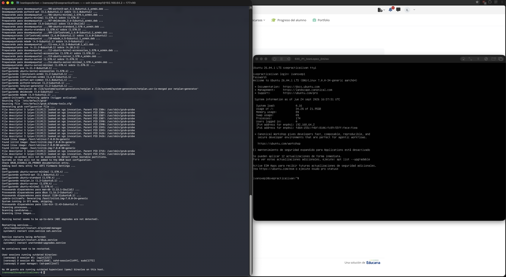

Wordpress necesita una serie de requisitos para funcionar, el stack de dependencias que vamos a utilizar LAMP (Linux Apache MySQL y PHP)

### Instalar apache

para esto ejecutaremos el comando `apt install apache2` y luego una vez termine comprobaremos el estado el estado ejecutando `systemctl status apache2`.

Debería de salirnos algo similar a lo siguiente: 

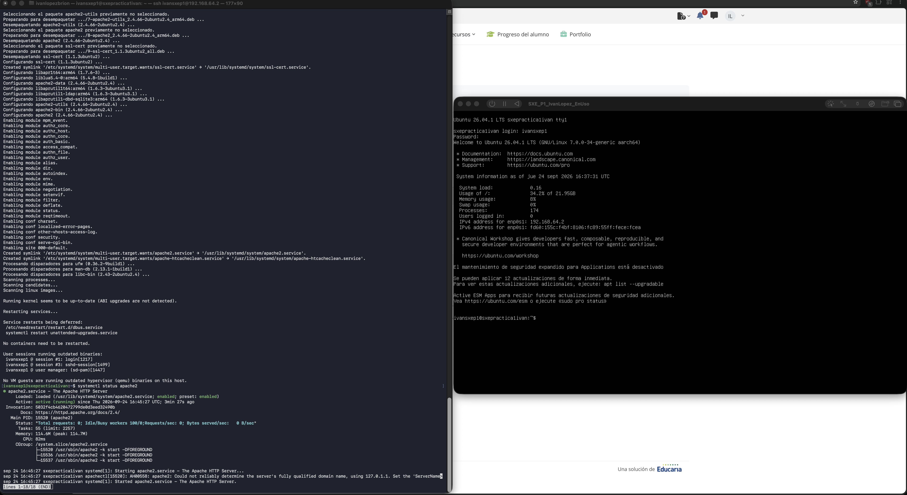

para cercionarnos aún más que está activo podemos ir a nuestro navegador y en localhost (en nuestro caso trabajando en local) poner la ip del servidor (la mv) en el buscador para saber si está activo, debería de salir algo como esto: 

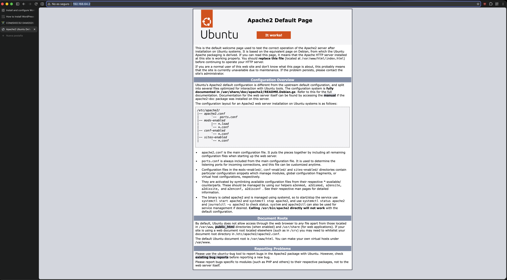

### Instalar la base de datos MySQL

Usaremos MariaDB, ya que es un fork the MySQL y la mayoría de hostings hoy en día lo prefieren a MySQL

ejecutaremos `sudo apt install mariadb-server mariadb-client`

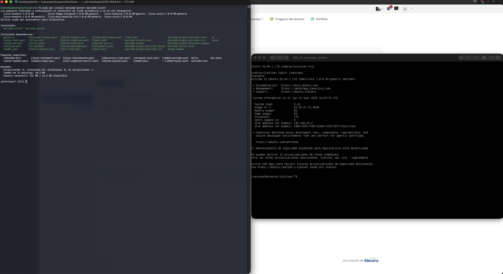

luego procederemos a cambiar la contraseña de la base de tados.

La guía que he seguido usa el siguiente comando: `mysql_secure_installation`

Este comando en mi experiencia personal no funcionó como el la guía se menciona pues no lo reconoce mariaDB, seguramente usando MySQL base sí que sirva pero en mi caso probé a cambiar mysql por mariadb en el comando y en vez de guiones bajos "_" usando "-". Usando tab me salió automáticamente la opción de utilizar el comando `mariadb-secure-installation`.

Este comando me daba varios errores pues no me dejaba iniciar sesión en la base de datos por mucho que introduciese la contraseña de root, por lo cual inicié sesión como root con `sudo su` cosa que podría haber hecho hace rato.

Luego volví a probar con este comando y funcionó

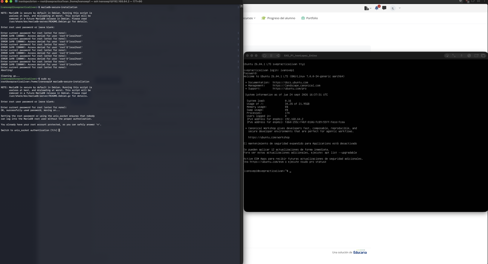

A continuación nos preguntará si queremos cambiar a unix socket autentication, esto elimina la contraseña de root y todo usuario que sea root es automáticamente al iniciar sesión en la base de datos root de la base de datos. El problema de esto es el trabajar a distancia ya que dependemos de los usuarios de dentro del sistema opeerativo, en nuestro caso particularo no habría problema pero yo he respondido que no

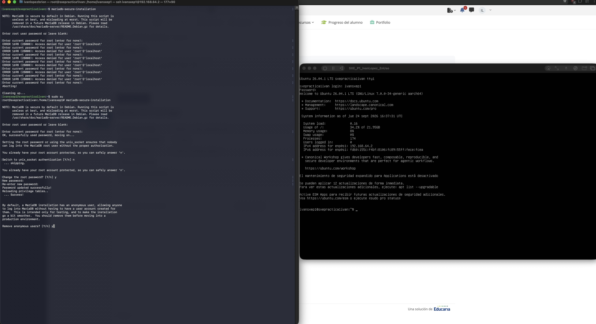

Luego tendremos que ver si queremos cambiar nuestra contraseña de root para acceder a la base de datos, en mi caso pude que si pero no es necesario, podríamos reponder que no y simplemente sería la misma contraseña que la de root del equipo

Respondemos que sí a eliminar a los usuarios anonimos por cuestiones de seguridad


Nos preguntará si queremos deshabilidar el login remoto, respondemos que sí por seguridad y porque en nuestro caso podemos iniciar sesión en local. En caso de querer configurar un servidor virtual y hacer pruebas podríamos dejarlo 

Nos preguntará despues si queremos borrar la base de datos de test que trae mariaDB por defecto y respondemos que sí.

Por último refrescamos los privilegios de la base de datos y efectuamos los cambios

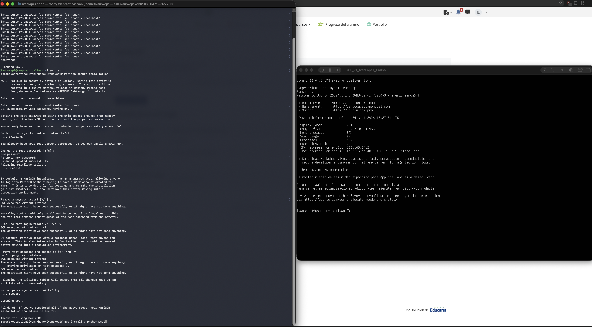

### Instalar PHP

Tras tener la base de datos funcionando podemos proceder a instalar PHP ejecutando `apt install php php-mysql`

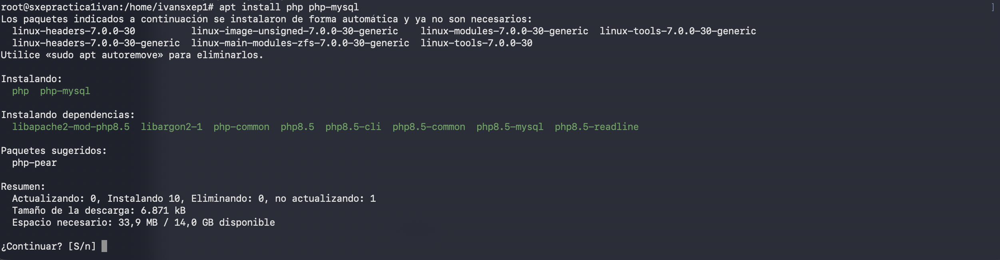

Instalamos las dependencias y luego para confirmar que PHP está instalado editaremos el archivo info.php utilizando el malvado VIM.

Abriremos el archivo con `vim /var/www/html/info.php` y introduciremos el siguiente contenido
````
<?php
phpinfo();
?>
````

Para todo aquel que no haya tocado vim antes, para salir guardando los cambios se usa `:wq`.

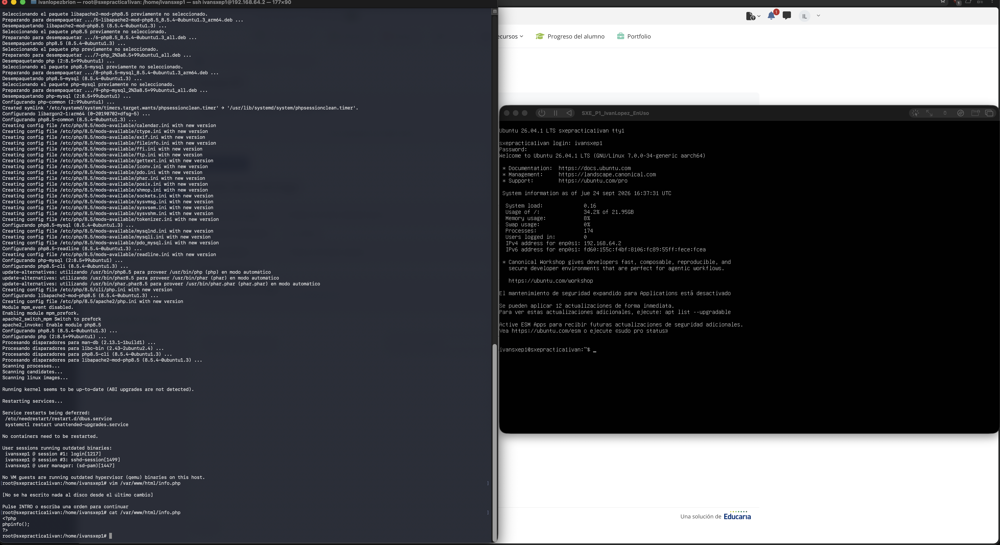

Una vez hecho esto podremos abrir nuestro navegador y poniendo "ip-de-nuestro-servidor/info.php" debería de abrírsenos la siguiente página.


### Crear base de datos

Iniciamos sesión como root en la base de datos `mysql -u root -p`

y una vez dentro creamos la base de datos `CREATE DATABASE wordpress_db;` (importante el ;)

damos privilegio al usuario y le definimos una contraseña con `GRANT ALL ON wordpress_db.* TO 'wp_user'@'localhost' IDENTIFIED BY 'password';`

Una vez hecho eso podemos salir de la base de datos

```
FLUSH PRIVILEGES;
Exit;
```
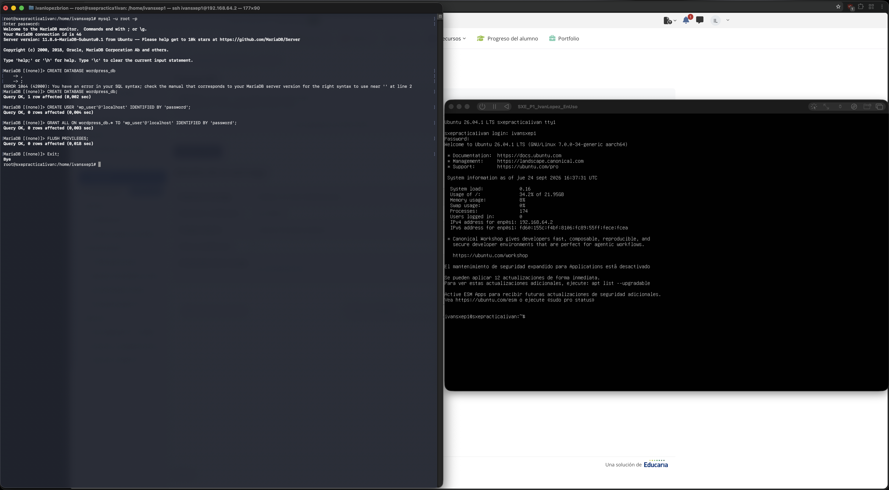

### Instalar wordpress

Vamos a nuestra carpeta temp `cd /tmp`

Descargamos el archivo más nuevo `wget https://wordpress.org/latest.tar.gz`

Y lo descomprimimos y esto generará la carpeta wordpress `tar -xvf latest.tar.gz`

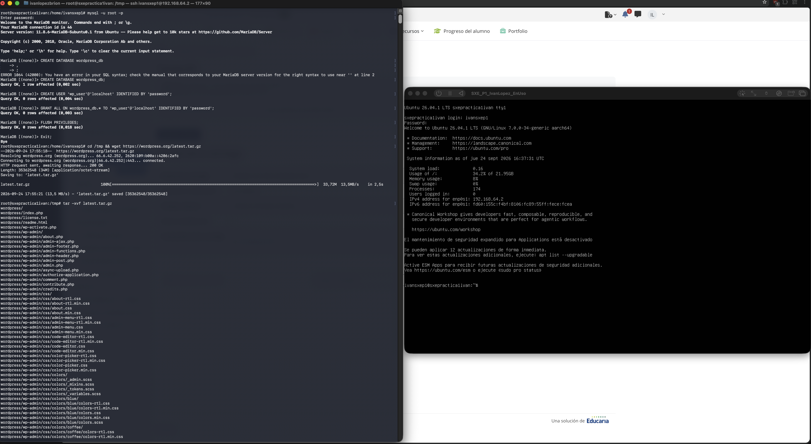

copiamos la carpeta wordpress a **/var/www/html/**
* `cp -R wordpress /var/www/html/`

cambiamos el propietario de la carpeta wordpress con el siguiente comando
* `chown -R www-data:www-data /var/www/html/wordpress/`

modificamos los permisos de la carpeta
* `chmod -R 755 /var/www/html/wordpress/`

creamos la carpeta "uploads"
* `mkdir /var/www/html/wordpress/wp-content/uploads`

y por último cambiamos el permiso de la categoría "uploads"
* `chown -R www-data:www-data /var/www/html/wordpress/wp-content/uploads/`

Si todo ha ido bien deberíamos de poder entrar en nuestro navegador y buscar en localhost "**ip-del-servidor/wordpress**" podremos ya ver nuestro servicio de wordpress funcionando.

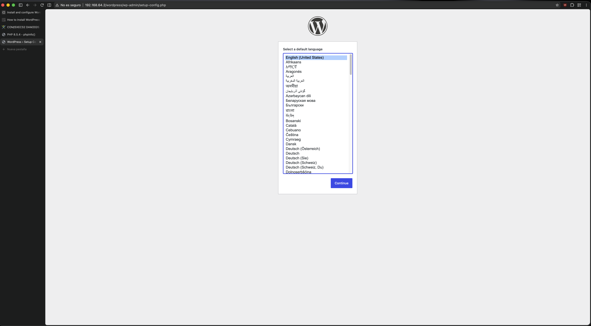

Una vez dentro seleccionamos idioma y rellenamos datos como se puede ver en la imagen de abajo, respetando los nombres y el resto de credenciales que hemos usado al crear la base de datos, el host en nuestro caso es localhost y el prefijo de tabla lo podemos dejar en "wp_".

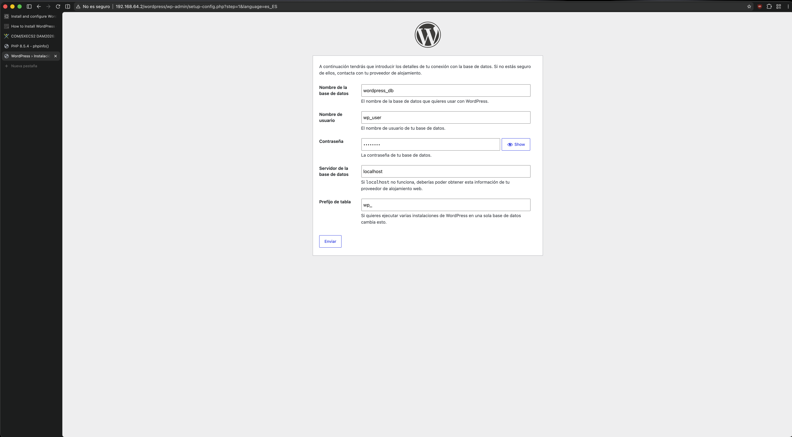

Continuamos y ahora rellenamos los datos con los que queremos crear nuestro blog y haciendo caso a la guía nos cercionamos de poner una contraseña segura.

En este ejemplo de práctica no es importante el uso de un gmail pero en caso de tener un servicio real con el es con el que se recuperaría la contraseña etc.

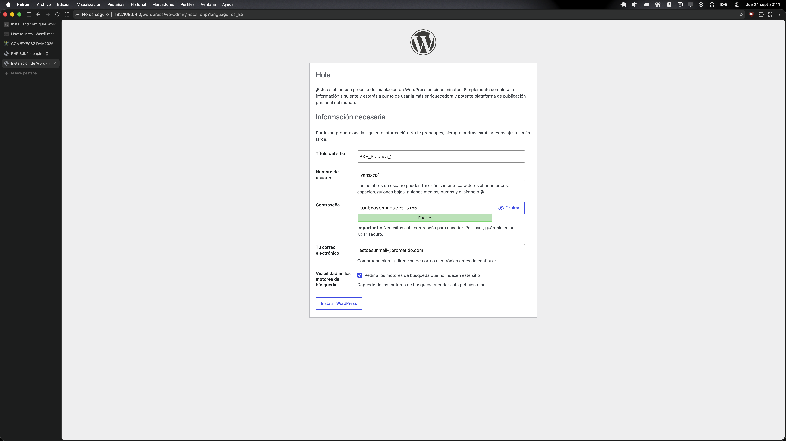

Listo ya podríamos entrar en nuestro blog

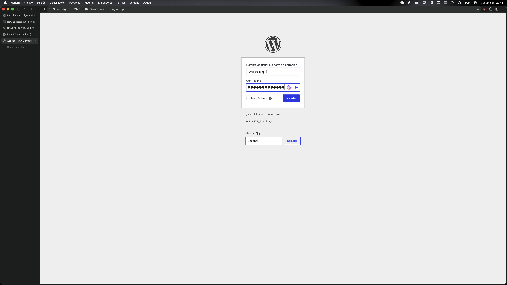